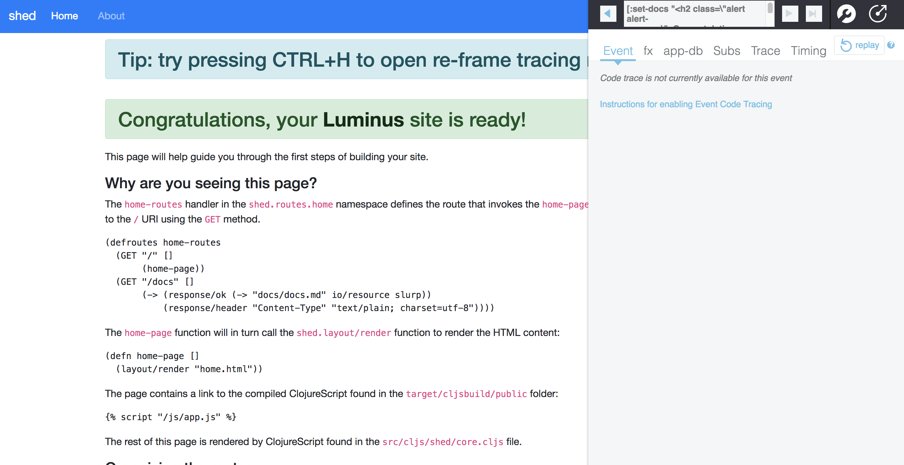

# clojure-shed
- learn how to develop and deploy with Clojure & Clojurescript
- Part 1: build hello world with Clojure deployed to Heroku
- Part 2: build a simple API to store stuff using Clojure, Clojurescript, Leiningen, Docker, and PostgreSQL deployed to Zeit or Heroku

## Requirements

- install [clojure](https://clojure.org/)     
- install [java](https://java.com/en/download/)      
- install [leiningen](https://leiningen.org/)      

## Getting Started Part 1: Clojure & Clojurescript

#### Focus on Clojure

Although the goal is to eventually deploy to Zeit, for now (until we figure that out) let's deploy to Heroku since they have created a sample ["hello world" Clojure project]((https://devcenter.heroku.com/articles/getting-started-with-clojure) which makes it incredibly easy to do so.

```
$ git clone https://github.com/heroku/clojure-getting-started.git
$ cd clojure-getting-started
$ lein repl
user=> (require 'clojure-getting-started.web)
user=>(def server (clojure-getting-started.web/-main))
```

Your app should now be running on [localhost:5000](http://localhost:5000/).

Now you can deploy the hello world to Heroku:

```
$ heroku login
$ heroku create
$ git push heroku master
$ heroku open
```

#### Focus on Clojurescript

You have built several React & Redux projects and now wish to learn the equivalent in Clojurescript which is [Reagent](https://reagent-project.github.io/) & [Re-frame](https://github.com/Day8/re-frame).  

We will leverage the [luminus framework](http://www.luminusweb.net/) which is included in the latest version of leiningen

```
$ lein new luminus shed +postgres +cljs +reagent +re-frame
$ cd shed
$ lein run
```

You should see this screen in your browser:

Open the browser to http://localhost:3000


Now stop the terminal and then commamd-t to open a new tab and from the same directory run:

```
$ lein figwheel
```

Then return to the previous tab and run: ```$ lein run``` again

You should see this screen in your browser:



## Getting Started Part 2: Add PostgreSQL

## Docker

Edit the docker file to ensure that it builds the uberjar

```
lein uberjar
```

## Deploy

#### [Zeit.co](https://zeit.co) - hopefully coming soon - skip to Heroku

```
$ now
```

I need help here - I've deployed a Python API to Zeit via docker and it should - in theory - be a similar process.

If you have an advice, let's discuss it in this issue thread.

#### [Heroku](https://heroku.com)

For more information about using Clojure on Heroku, see these Dev Center articles:

- [Getting Started with Clojure on Heroku](https://devcenter.heroku.com/articles/getting-started-with-clojure)
- [Clojure on Heroku](https://devcenter.heroku.com/categories/clojure)

## Credit

I wanted to learn how to put together a clojure project so I basically dismantled [yogthos memory-lane](https://github.com/yogthos/memory-hole) to build this project.

## Resources

[N00b walktrough of re-frame](http://www.multunus.com/blog/2016/02/noobs-walkthrough-re-frame-app/)

# Github Projects  
[ventas e-commerce](https://github.com/JoelSanchez/ventas)

[Conduit](https://github.com/jacekschae/conduit)

[re-pollsive](https://github.com/gadfly361/re-pollsive)

[Flashcards](https://github.com/alexanderjamesking/flashcards)

[etudes for sclojurescript](https://github.com/jdeisenberg/etudes-for-clojurescript)

## clojurians
[beginners](https://clojurians-log.clojureverse.org/beginners/2017-11-01)

## Podcasts
[lispcast](https://lispcast.com/)

## RSS
[elfeed-cljsrn](https://github.com/areina/elfeed-cljsrn)

## Creator of Clojure
[Rich Hickey](https://www.infoq.com/profile/Rich-Hickey)
